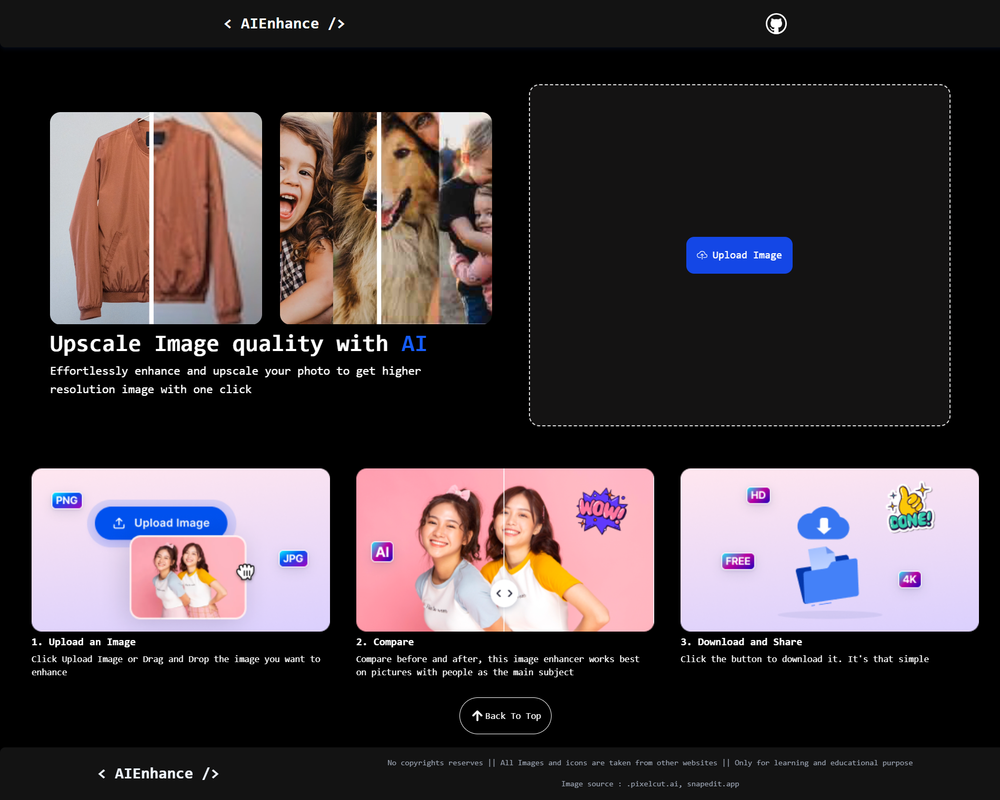

# 🧠 AiEnhance

A simple yet powerful image enhancement tool built to improve the quality of your images using modern techniques. Whether it's sharpening, brightness adjustment, or color correction — **AiEnhance** has you covered.

## 🔍 Features

- 🖼️ Upload images (JPG, PNG, etc.)
- ✨ AI-powered Auto Enhancement
- 💾 Download the enhanced image
- ⚡ Fast performance with Vite + React

## 📸 Demo

### 🖥️ Website UI



### 🔄 Before and After Comparison


## 🚀 Getting Started

### 📦 Prerequisites

- [Node.js](https://nodejs.org/) installed

### 🛠️ Installation

```sh
git clone https://github.com/abhaylonkar/AiEnhance.git
cd AiEnhance
npm install
npm run dev
```

`Then open your browser and go to http://localhost:5173`  

### 🌐 API Integration  

**This project uses the [Picsart Enterprise](https://picsart.io/) API for AI-based image enhancement.**

_🔐 You need a valid API key from Picsart to run this project in production._

To set up your API key:

- Create a .env file in the root directory.
- Add your key like this:

```ini
VITE_API_URL=your_api_url_here
VITE_API_KEY=your_api_key_here
```

## 🛠️ Built With

- ⚛️ React
- ⚡ Vite
- 🎨 Tailwind CSS

## 🙋‍♂️ Author

- Abhay Lonkar
- 📧 <abhaylonkar9@gmail.com>
- [🔗 My Portfolio](http://abhaylonkar.github.io/)
